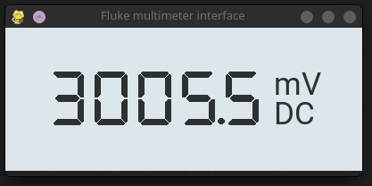

# Fluke multimeter interface
This program is a graphical user interface, that display's values from your Fluke multimeter.



## Instalation
For using this program you need 2 dependencies installed on your computer:
1. pyserial - used for communication with the multimeter
2. pygame - used for the GUI

Please reffer to the documentation of those 2 libraries for installation.

## Using the program
Before launching, make sure that you have the right serial device selected. To change the device name, just eddit the `fluke_device` at the top of the main.py file.
```py
fluke_device = "/dev/ttyUSB0"
``` 

Before launching the program your multimeter __**must be turned on**__, otherwise the program will hang when it trys to read form the device. 

## Contributors
A big thank you goes to [@theKlinc](https://github.com/theKlinc) for designing the GUI of this application. 

There are 2 font's used, Google's Roboto and 7 segment display font from the user [@keshikan](https://github.com/keshikan):

https://github.com/googlefonts/roboto

https://github.com/keshikan/DSEG