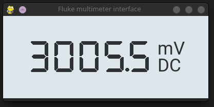

# Fluke multimeter vmesnik
Ta program je grafični vmesnik, ki prikazuje vrednosti z vašega Fluke multimetra



## Namestitev
Za uporabo tega programa rabiš namestiti dvoje zanesljivost na računalnik:
1. pyserial - uporabljen za komunikacijo z multimetrom
2. pygame - uporabljen za GUI

Za namestitev zgornjih knjižnjic, poglejte njuno dokumentacijo

## Uporaba programa
Pred zagonom, se prepričajte ta imate izbrano pravo serijsko napravo. Da spremenite ime naprave, samo spremenite `fluke_device` na vrhu datoteke main.py
```py
fluke_device = "/dev/ttyUSB0"
```

Pred zagonom programa, mora biti __**vaš multimeter prižgan**__, drugače bo program čakal, ko poskuša prebrati iz naprave.

## Sodelovalci
Velika zahvala gre [@theKlinc](https://github.com/theKlinc)-u za oblikovanje grafičnega vmesnika te aplikacije.

Uporabljeni sta dve pisavi: Googlov Roboto in 7 segmentni ekran pisava, ki ga je naredil  [@keshikan](https://github.com/keshikan):

Hvala [@Axodus](https://github.com/Axodus) za prevod tega README.md v slovenščino in za popravo napak v angleškem README.

https://github.com/googlefonts/roboto

https://github.com/keshikan/DSEG